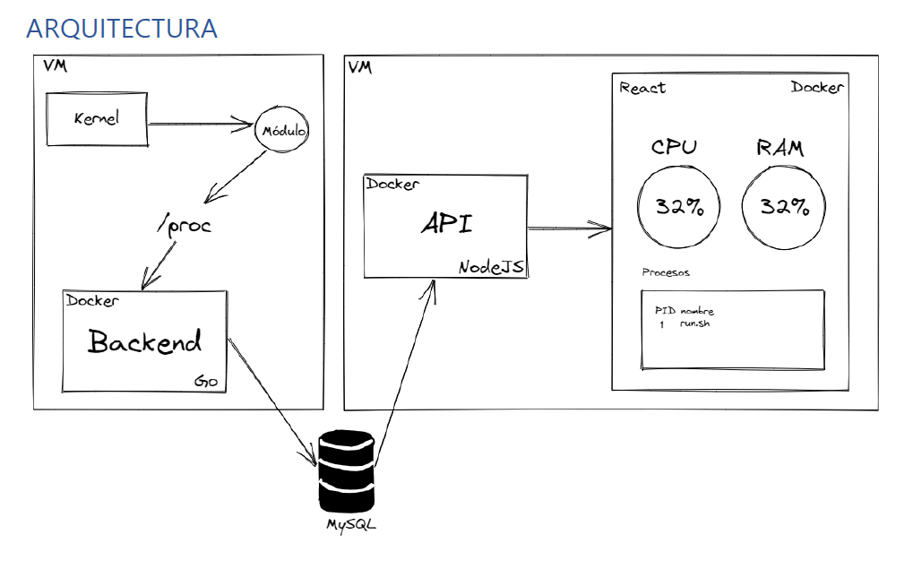

# Práctica 2 - Sistemas Operativos 1 - Segundo Semestre 2022

# Arquitectura

# Servidores utilizados

1. Backend Golang(:4000) -- v.1.18.1 
2. Servidor en NodeJs(:5000) -- v.16.13.0
3. Frontend con ReactJs(:3000) -- v.16.8.6
4. Base de datos Mysql en GCP(:mysql)

__*Todos los servidores fueron levandas en vms de GCP utilizan docker para su deployment.*__

# Estrucura del proyecto

**Modules (C)**
- cpu
    - cpu_201115018.c => módulo utilizado para recuperar datos de la cpu. Se utilizan las librerias **<linux/sched.h>** y **<linux/sched/signal.h>** para recuperar datos como el pid, procesos y mémoria con métodos como for_each_process o get_mm_rss. Estos datos son recuperados desde un módulo creado llamado cpu_201115018 y levantado con el comando cat desde /proc.   
- ram
    - ram_201115018.c => módulo utilizado para recuperar datos de la ram. Se utiliza la libreria **<linux/hugetlb.h>** para recuperar datos del uso de la memoria para calcular el uso actual de la memoria RAM. Estos datos son recuperados desde un módulo creado llamado ram_201115018 y levantado con el comando cat desde /proc.  
 __*Para la generación de los módulos se utilizo make.*__

**Backend**
- main.go => Se creo un servidor de go utilizando **net/http** para poder guardar los datos recuperados desde modules en la base de datos mysql. Para recuperar los datos a guardar se utiliza el método **exec.Command** para ejecutar el comando cat de los módulos anteriormente montados desde modules. Estos módulos también formatean los resultados en json.

**Servidor NodeJS**
- src/index.js => Servidor levantado con la librería **express** y que entrega datos en 2 rutas /getDataRAM y /getDataCPU, ambas rutas utilizan el método get par su funcionamiento y entregan los resultados obtenidos desde la base de datos y son enviados en formato json hacia los consultantes.

**Frontend **
- src/components/ChartRam.js => Componente utilizado para crear una gráfica con la librería **ChartJS** que muestra los datos recuperados desde le servidor NodeJS y referentes al uso de la ram. La gráfica es de tipo pastel y muestra la ram utilizada y las ram libre.
- src/components/ChildrenTable.js => Componente utilizado para la generación de modals que guardan tablas con los datos recuperados por la ruta /getDataCPU y que estan relacionados estrictamente con los procesos hijos de los procesos en general mostrados en la aplicación.
- src/components/TableCpu.js => Componente utilizado para la generación de una tabla que muestra toda la información recuperada desde la ruta /getDataCPU y que esta relacionada estrictamente con los procesos y sus principales datos como el uid, el nombre y el uso de la memoria. Para los procesos hijos se utiliza el componente ChildrenTable para su visualización.
- src/index.js => Módulo principal el cual levanta el servidor del frontend.
- src/App.js => Función encargada de construir la página principal del frontend.

**DB Mysql**
- Tabla RAM => Tabla utilizada para guardar los datos relacionados con la RAM recuperados y enviados desde el backend en go. Su único atributo es info y guarda todos los datos recibidos en formato json.
- Tabla CPPU => Tabla utilizada para guardar los datos relacionados con la CPU recuperados y enviados desde el backend en go. Su único atributo es info y guarda todos los datos recibidos en formato json.

